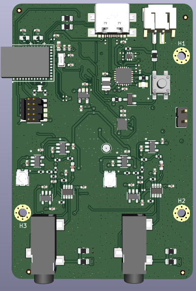
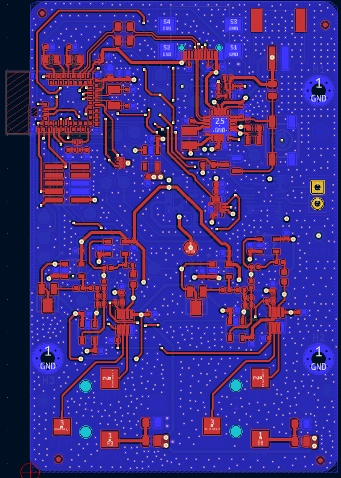
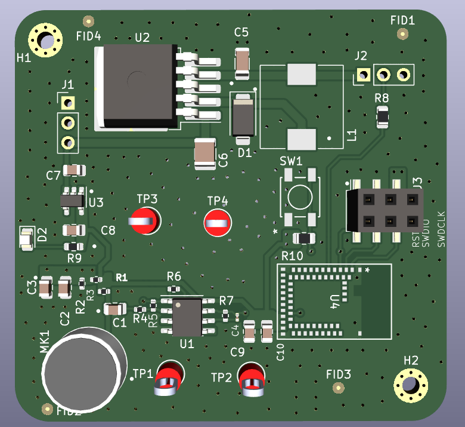
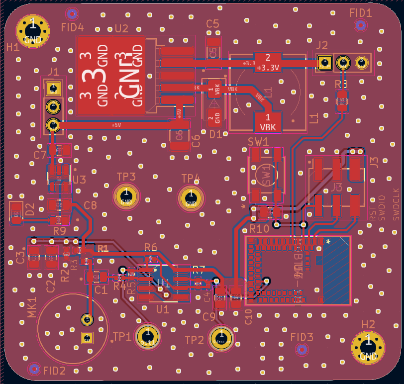
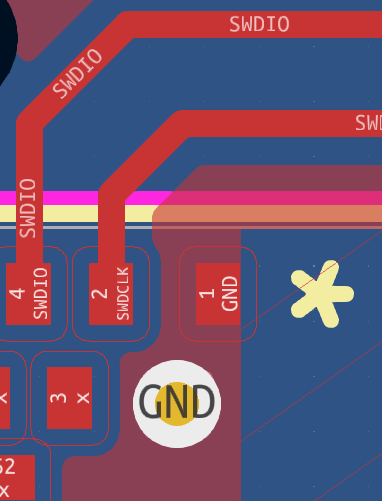
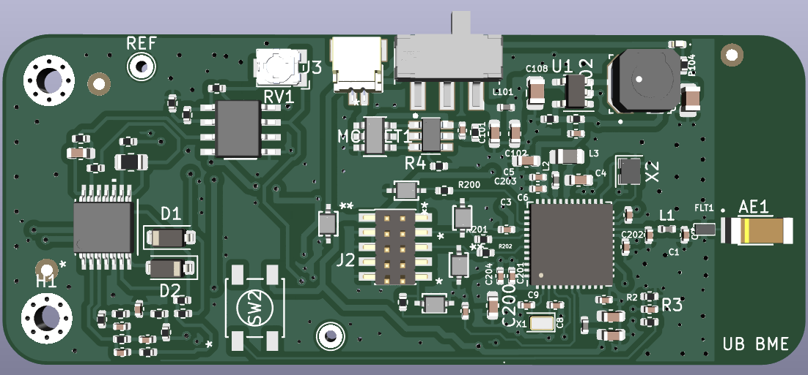
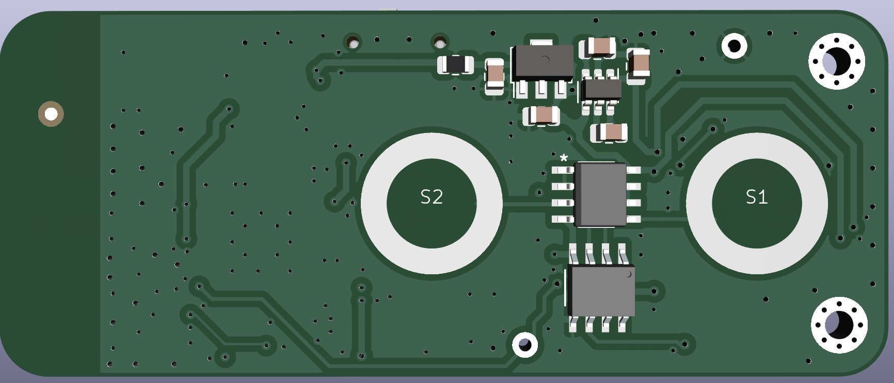
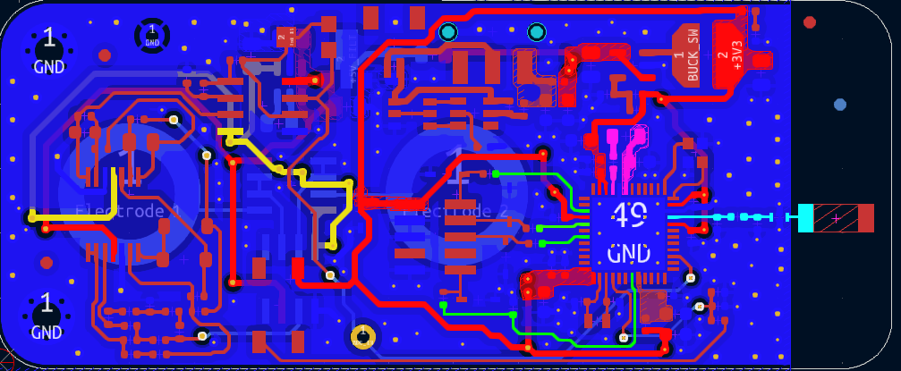

# Engineering Portfolio: Mike Miller

Hardware Design Engineer focused on wearable sensor integration and PCB design. This page documents my R&D process, design methodology, and troubleshooting logs for my current hardware projects.

---

## 🛠 Skills & Competencies
* **PCB Design:** KiCad (Schematic Capture, Layout, DFM)
* **Embedded Systems:** nRF5340, STM32WB, BLE Firmware integration
* **Analog/Mixed Signal:** ECG/EMG AFE designs, Audio/Optical systems
* **Instrumentation:** Oscilloscopes, Multimeters, Logic Analyzers

---

## 🚀 Featured Projects

### 1. Wearable 2-channel EMG with gyroscope & buzzer for real-time bio-feedback
*An initial prototype of a neural-feedback system for reading movement/muscle data and notifying the user of biomechanical events*

#### Overview
- **Objective:** Design a wireless, multi-channel EMG to enable any user to access every-day movement patterns.
- **Key Components:** nRF5340 MDBT53-1M SOC, USB, rechargeable Li-Ion battery.

#### Engineering Process
- **Design Philosophy:** Focus on design validation to improve the form factor in later iterations.
                  
                  
- **Debug Log / Lessons Learned:**
    - **Issue:** None yet, awaiting assembly.
    - **Future Iteration:** Significantly reduce form factor to fit in mechanical housing and support adhesion to various body locations.

#### Status
- **Current Phase:** Design verification to ensure functionality before intended final revision.

### 2. FFT-Based LED Strip Controller
*A compact, wall outlet compatible device for creating dynamic, color changing LED's that travel across the entire length of an LED Strip.*

#### Overview
- **Objective:** Design an audio based system for reading audio signals, deriving the base frequencies, and changing the color of LEDs on the strip.
- **Key Components:** nRF5340 MDBT53-1M SOC, analog front end, buck converter, LDO.

#### Engineering Process
- **Design Philosophy:** Focused on filtering out sound for ease of signal processing and FFT analysis.
           
- **Debug Log / Lessons Learned:**
    - **Issue:** Could detect target device when programming, but could not flash to the core.
    - **Root Cause:** Inadequate pad-to-pour clearance in the initial layout - short between GND and SWDCLK.
      
    - **Resolution:** Validated via continuity testing.
    - **Future Iteration:** Relocate GND via near SWDCLK on MDBT53-1M pads, reduce GND pour coverage near pads.

#### Status
- **Current Phase:** Power/digital architecture validated. AFE and firmware validated on breadboard for full LED control. Redesign to relocate via and pour profile.

### 3. Wireless EMG Wearable
*A compact, low-power wearable device for EMG signal acquisition.*

#### Overview
- **Objective:** Design a small-scale wearable EMG sensor node with integrated BLE for remote monitoring.
- **Key Components:** STM32 MCU, Custom Analog Front End (AFE), LiPo Battery.

#### Engineering Process
- **Design Philosophy:** Focused on miniaturization and high SNR for biosignals.
- **CAD/Layout:**  
                  
                   
                  
                   
                  
- **Debug Log / Lessons Learned:**
    - **Issue:** Encountered configuration issues when setting up STM32WB through STM32CubeIDE.
    - **Root Cause:** Inadequate reflow on STM32 during assembly.
    - **Resolution:** Validated via continuity testing.
    - **Future Iteration:** Design around reflow, select another chip.

#### Status
- **Current Phase:** Architecture validated. Analog AFE performance verified; digital core transitioning for ease of assembly.

---

## 🔍 Current R&D: "Golden Reference" Platform
I am currently developing a modular "Golden Reference" motherboard for the nRF5340 MDBT53-1M module. 
* **Goal:** To decouple digital bring-up from complex sensor/analog integration.
* **Architecture:** Core board (MCU/Power) + Carrier board (AFEs/Sensors).
* **Expected Outcome:** A proven baseline for all future wearable sensor iterations.

---

## 📧 Contact
- **LinkedIn:** www.linkedin.com/in/michael-miller-4b3918201
- **Email:** mmille7497@gmail.com
